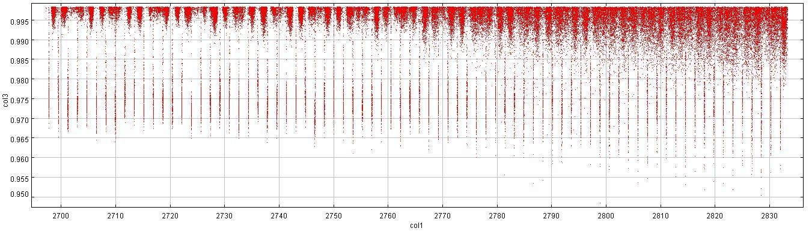
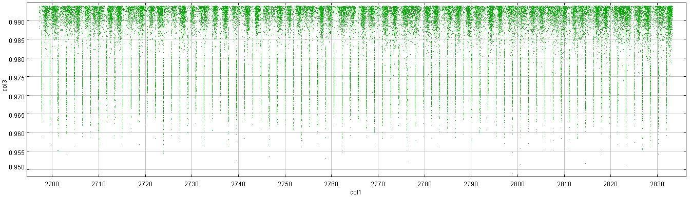
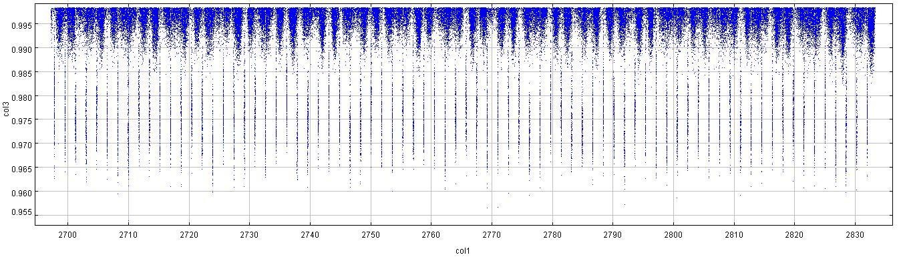
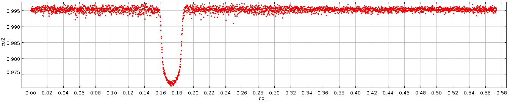
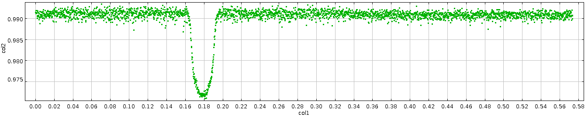
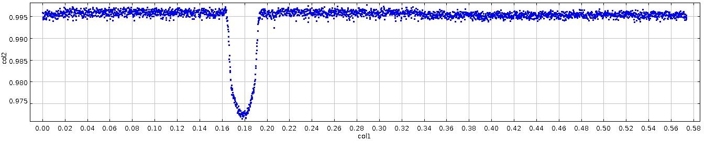

# ACROM

ACROM
** Tools for analysis of Light Curves from CoRoT **

A set of python scripts for studing the chromatic COROT Light Curves.
Contains scripts for filtering, detrending and plotting  the chromatic light curves registered by the COROT Satellite.
This tools may be utils for treat with chromatic light curves (coming from COROT or other surveys) with purpose to study the  achromatic nature of exoplanetary transits.

## Filtering:
From a raw COROT light curve in ASCII Format (i.e, corot-2b.txt), this script allows to filter bad points (status > 0) and to generate sub light curves Red (R), Green (G) and Blue (B) in their respective files.

## Detrending: 
From the sub light curves (R,G,B), this script runs a moving average algorithm  (a type of Convolution) to deal  with the COROT Light Curves ’ s long-term trend.

## Folding Phase: 
Applies folding phase to sub light curves (R,G,B).

## Plotting: 
This scripts allows to show the graphs of sub light curves generated.

# Author

Derian Jesús Dorado-Daza (2014)
